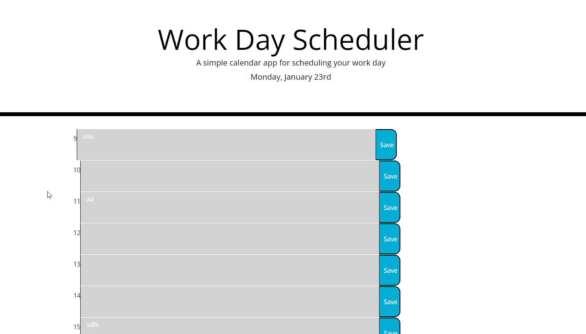

# Weekly Planner App

## Description

Note - I worked on setting the colours of past/present/future classes for hours & a TA helped a huge amount but we both couldn't work out the bug together. If you can provide the solution it would be great to help my learning?

The weekly planner app has been built so I can better plan my days at work & can schedule things in by the hour, due to me being slightly unorganised at work.

It has allowed me to get back on top of my work & I have learned a huge amount in the build of this, including JQuery & improving my knowledge on local storage.

## Usage

To access the weekly planner app, you can find links to the code and a working version online below

https://github.com/barrymoore1990/weekly-planner-app
https://barrymoore1990.github.io/weekly-planner-app/

When using yourself, simply type your activity in the text area for the hour you would like & click save it will store there. A screenshot of it in use is below

## License

MIT License

Copyright (c) [year] [fullname]

Permission is hereby granted, free of charge, to any person obtaining a copy
of this software and associated documentation files (the "Software"), to deal
in the Software without restriction, including without limitation the rights
to use, copy, modify, merge, publish, distribute, sublicense, and/or sell
copies of the Software, and to permit persons to whom the Software is
furnished to do so, subject to the following conditions:

The above copyright notice and this permission notice shall be included in all
copies or substantial portions of the Software.

THE SOFTWARE IS PROVIDED "AS IS", WITHOUT WARRANTY OF ANY KIND, EXPRESS OR
IMPLIED, INCLUDING BUT NOT LIMITED TO THE WARRANTIES OF MERCHANTABILITY,
FITNESS FOR A PARTICULAR PURPOSE AND NONINFRINGEMENT. IN NO EVENT SHALL THE
AUTHORS OR COPYRIGHT HOLDERS BE LIABLE FOR ANY CLAIM, DAMAGES OR OTHER
LIABILITY, WHETHER IN AN ACTION OF CONTRACT, TORT OR OTHERWISE, ARISING FROM,
OUT OF OR IN CONNECTION WITH THE SOFTWARE OR THE USE OR OTHER DEALINGS IN THE
SOFTWARE.
